# Two-Way Fluid-Structure Interaction Analysis of an S-Shaped Pipe

Multiphysics analysis of a fuel-oil S-shaped pipe combining transient two-way FSI between ANSYS Fluent and Mechanical, followed by modal, harmonic response, and high-cycle fatigue assessment.

The project combines:

- ANSYS Workbench 2024 R1
- Fluent (transient CFD with dynamic mesh)
- Mechanical APDL (Static Structural)
- System Coupling (two-way FSI orchestration)
- Modal analysis with Block Lanczos solver
- Harmonic Response (Mode Superposition)
- Fatigue Tool (Stress Life, Goodman correction)
- SolidWorks 2025 (parametric CAD)

to assess pipe integrity under combined hydrodynamic loading, resonance, dynamic amplification, and cyclic fatigue.

---

## Project Objectives

- Validate the CFD flow setup against handbook pressure-drop estimates
- Quantify structural response under two-way coupled fluid load
- Extract natural frequencies and assess resonance margin against vortex shedding
- Determine dynamic amplification factor and combined peak stress
- Estimate high-cycle fatigue life and safety factor at the design point
- Identify the governing failure mechanism (if any)

---

## Software

| Software | Purpose |
|---|---|
| ANSYS Workbench 2024 R1 | Multiphysics project orchestration |
| ANSYS Fluent 2024 R1 | Transient CFD, dynamic mesh, k-ω SST turbulence |
| ANSYS Mechanical 2024 R1 | Static Structural, Modal, Harmonic Response, Fatigue Tool |
| ANSYS System Coupling | Two-way FSI data exchange |
| ANSYS Fluent Meshing | Watertight Geometry workflow, poly-hexcore mesh |
| SolidWorks 2025 | Parametric CAD modelling, STEP export |

---

## Geometry

S-shaped steel pipe with two tight 90° bends in opposite directions, separated by a short straight section. Flanges at each end accept 8 bolts apiece for connection to upstream and downstream pipework.

| Parameter | Value |
|---|---|
| Pipe outer diameter (OD) | 100 mm |
| Pipe inner diameter (ID) | 80 mm |
| Wall thickness | 10 mm |
| Bend radius (centreline) | 40 mm |
| R/D ratio | 0.5 (tight bend) |
| Flange outer diameter | 150 mm |
| Bolt count per flange | 8 |
| Bolt hole radius | 4 mm |
| Total axial length | ~250 mm |
| Fillets at transitions | 2 mm |

### CAD Geometry

<!-- Add CAD isometric view -->
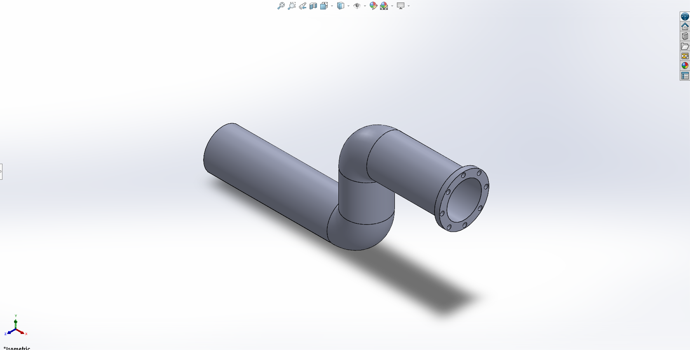

<!-- Add CAD view showing flange detail -->
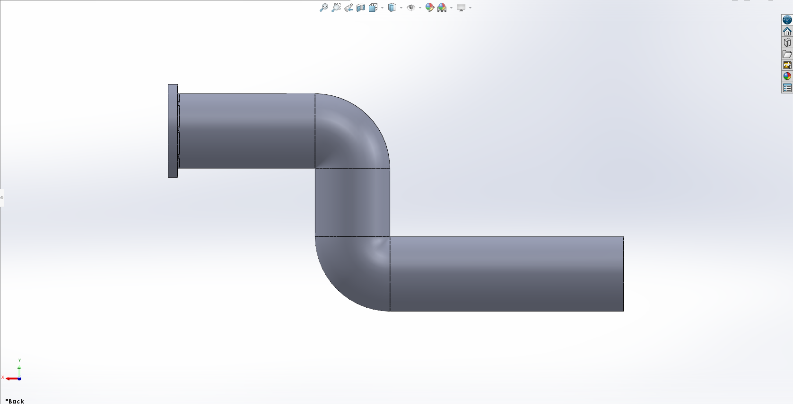

---

## Operating Conditions

| Parameter | Value |
|---|---|
| Working fluid | fuel-oil-liquid (ANSYS database) |
| Density (ρ) | 960 kg/m³ |
| Dynamic viscosity (µ) | 0.0483 Pa·s |
| Inlet velocity | 6 m/s |
| Outlet boundary | Gauge pressure = 0 Pa |
| Reynolds number (ρvD/µ) | ~9,540 (fully turbulent) |
| Flow-through time (L/v) | 0.0417 s |

---

## Material Properties

Aluminium-style nominal values from the ANSYS Structural Steel library, representative of API 5L grade X42 to X52.

| Property | Value |
|---|---|
| Young's modulus | 200 GPa |
| Poisson's ratio | 0.3 |
| Density | 7,850 kg/m³ |
| Yield strength | 250 MPa |
| Ultimate strength | 460 MPa |
| S-N curve source | ASME BPV Code, Section 8 Div 2, Table 5-110.1 |
| Endurance limit (10⁶ cycles) | 86.2 MPa |

---

## Analysis Workflow

Five linked phases were chained in the Workbench schematic so that each downstream analysis inherits the converged state of the previous one.

| Phase | Analysis | Solver | Role |
|---|---|---|---|
| 1 | Steady CFD | Fluent | Verify flow setup, provide initial condition for Phase 2 |
| 2 | Two-way FSI | Fluent + Mechanical via System Coupling | Compute fluid load and structural response |
| 3 | Modal | Mechanical | Extract natural frequencies and mode shapes |
| 4 | Harmonic Response | Mechanical (Mode Superposition) | Compute frequency response and DAF |
| 5 | Fatigue | Mechanical Fatigue Tool | Estimate Life, Damage, and Safety Factor |

### Workbench Schematic

<!-- Add Workbench Project Schematic screenshot -->
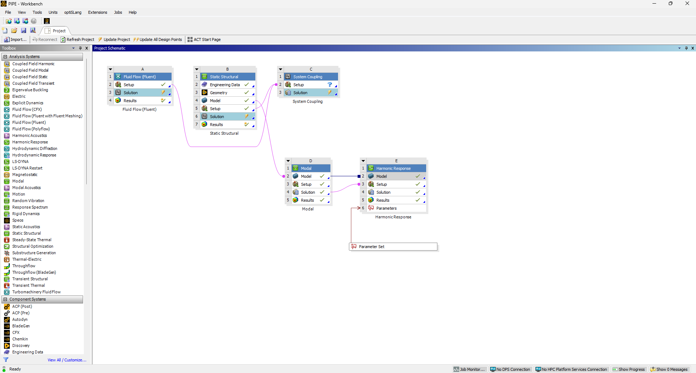

---

## Meshing

### Fluid Zone Extraction

The internal fluid volume was extracted from the solid pipe geometry in ANSYS SpaceClaim using the Volume Extract tool. The resulting fluid body shares the wetted-wall faces with the solid pipe — the interface that System Coupling later uses for FSI data exchange.

<!-- Add SpaceClaim solid zone view -->
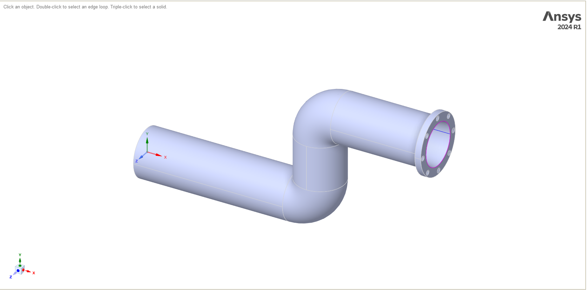

<!-- Add SpaceClaim fluid zone view -->
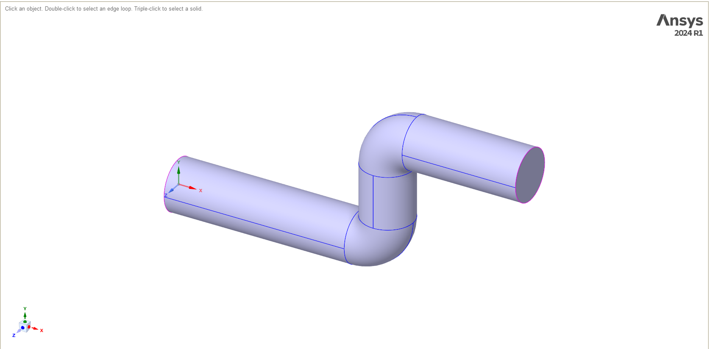

### Fluid Mesh

The fluid volume was extracted in SpaceClaim and meshed using the Fluent Meshing Watertight Geometry workflow with poly-hexcore volume fill. Poly-hexcore was chosen because of the tight R/D = 0.5 bends: an axis-aligned hex core minimises numerical diffusion of the streamwise momentum, while the polyhedral transition layer matches into a wall-normal prism stack.

A standalone *Fluid Flow (Fluent with Fluent Meshing)* system was used during mesh development before being replaced by the full FSI schematic.

<!-- Add Fluent-with-Fluent-Meshing schematic -->
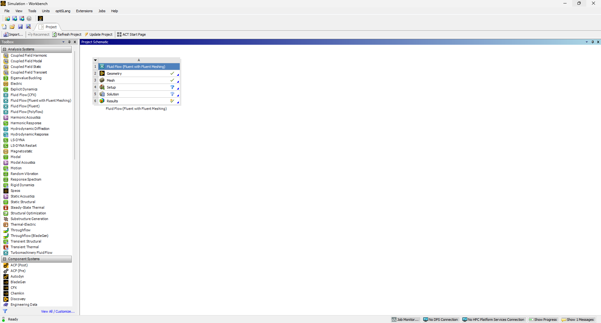

| Mesh Control | Value |
|---|---|
| Workflow | Watertight Geometry (Fluent Meshing) |
| Surface min/max size | 0.4 mm / 3.0 mm |
| Curvature normal angle | 18° |
| Local sizing at bends | Curvature + Proximity, 0.4–1.0 mm |
| Prism layers | 8 (smooth-transition, growth 1.2) |
| Volume fill | poly-hexcore |
| Max hex cell length | 1.6 mm (auto-clamped from 3 mm) |
| **Total cell count** | **2,533,282** |
| Min orthogonal quality | 0.124 |
| Max skewness | 0.876 |
| Average skewness | 0.019 |
| Max aspect ratio (prism) | 19.49 |

<!-- Add fluid mesh screenshot -->
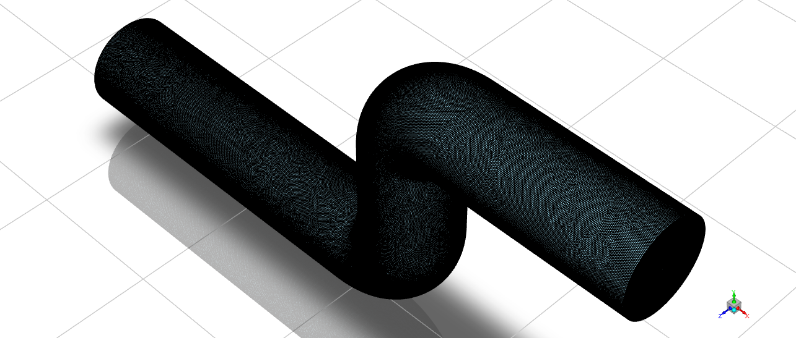

### Structural Mesh

Patch-Conforming tetrahedrons with quadratic SOLID186 elements (Program Controlled element order). Sweep and MultiZone methods were rejected because the flange-with-bolt-holes topology defeats automatic source-target face pairing in 2024 R1.

| Mesh Control | Value |
|---|---|
| Method | Tetrahedrons, Patch Conforming |
| Element type | SOLID186 (quadratic, 20-node) |
| Global element size | 2 mm |
| Face sizing on flanges | 1.5 mm |
| Edge sizing at bolt holes | 0.5 mm |
| Element quality (min / avg) | 0.176 / 0.85 |
| Skewness (max / avg) | 0.994 / 0.213 |
| Aspect ratio (max) | 10.66 |

<!-- Add structural mesh screenshot -->
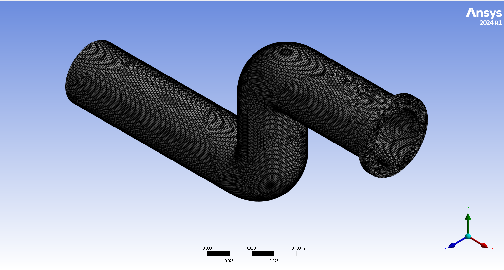

---

## Boundary Conditions

### Fluent

| BC | Value |
|---|---|
| Inlet | velocity-inlet, 6 m/s, I = 5%, D_h = 80 mm |
| Outlet | pressure-outlet, 0 Pa gauge |
| Wall (fsi_wall) | no-slip, kinematics from System Coupling |
| Dynamic mesh | Smoothing (Diffusion) + Remeshing on fsi_wall |

### Mechanical

| BC | Value |
|---|---|
| Fixed Support | Inlet flange face |
| Cylindrical Support | Outer cylindrical surface near outlet flange (Radial = Fixed, Axial/Tangential = Free) |
| Fluid Solid Interface | 10 inner bore faces (data-exchange surface) |
| Large Deflection | On |
| Solver Units | Manual / mks (matched to System Coupling) |

### System Coupling

| Setting | Value |
|---|---|
| Analysis Type | Transient |
| End Time | 5 × 10⁻³ s (5 timesteps) |
| Step Size | 1 × 10⁻³ s |
| Min / Max coupling iterations | 3 / 20 |
| Force convergence target | 0.05 (relative RMS) |
| Force under-relaxation | 0.7 |
| Displacement convergence target | 0.01 |
| Displacement under-relaxation | 0.8 |
| Intermediate Restart Output | Every step |

---

## Phase 1 — Steady-State CFD

### Velocity Field

Dean acceleration at both bends. Inner radius reaches 13.0 m/s maximum, outer radius decelerates into a low-velocity zone. The pattern reverses between the first and second bend, as expected for an S-shape.

<!-- Add velocity contour -->
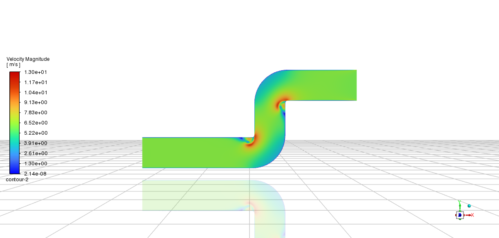

### Pressure Field

High pressure (+33.5 kPa) on the outer-bend walls and the upstream straight. Pressure recovery loss to ~ −78.8 kPa in the low-pressure cores at the inner-bend apices.

<!-- Add pressure contour -->
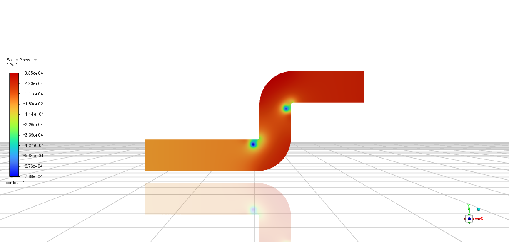

**Pressure drop:** ΔP = 25.5 kPa across the full S-bend. Sanity-checked against Crane TP-410 K-factors for two 90° bends at R/D = 0.5 plus straight friction at 6 m/s: handbook estimate 20–35 kPa. CFD result lies within the band.

### Wall Shear Stress

Maximum 3.32 kPa concentrated at the inner bend apices (erosion-critical zones). Straight sections and outer bends remain below ~350 Pa.

<!-- Add wall shear contour -->

### Pathlines

<!-- Add pathlines image -->
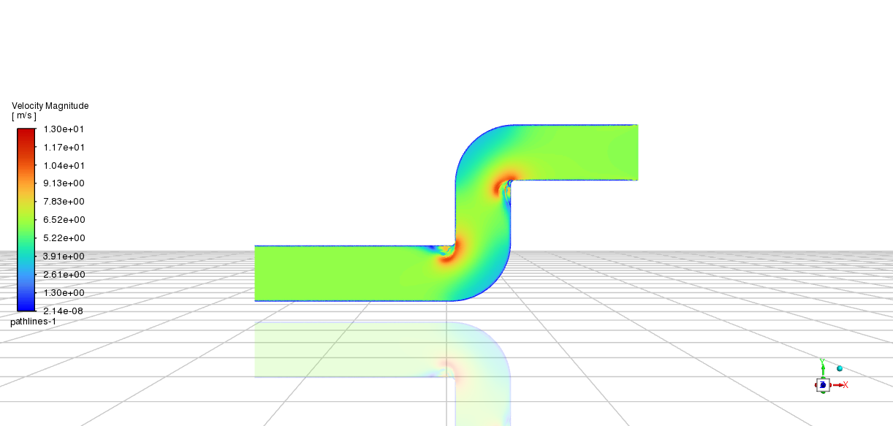

---

## Phase 2 — Two-Way Fluid-Structure Interaction

System Coupling alternately advanced Fluent and Mechanical at each coupling iteration. All five timesteps reached the convergence targets. Force and Displacement RMS values dropped from order 1 to order 1×10⁻¹⁰ to 1×10⁻¹² within roughly 16 to 20 coupling iterations per step.

### Compute Performance

| Item | Value |
|---|---|
| Workstation CPU | Intel i5-11400H, 6 cores / 12 threads |
| Fluent parallel processes | 4 |
| Total FSI wall-clock time | 16.9 hours (5 timesteps) |
| Mechanical share | 12.66 hours (75%) |
| Fluent share | 4.18 hours (25%) |
| System Coupling overhead | ~3 minutes (< 0.5%) |

### Total Deformation

Maximum 16.28 µm at the free end, tapering to zero at the Fixed Support. Cantilever-bending response of the inlet-supported pipe under fluid drag.

<!-- Add Total Deformation contour -->
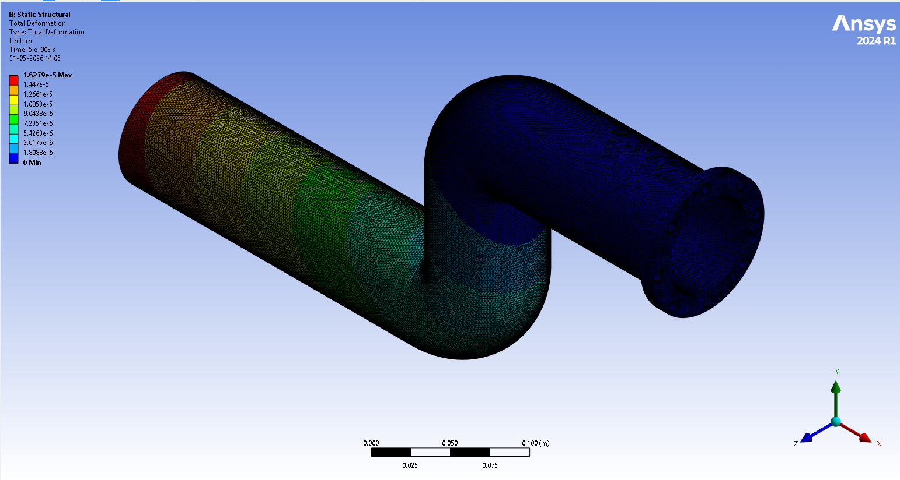

### Deformation Probe Location

A Deformation Probe was placed on the bend crown to track total displacement at the highest-response point over the five timesteps. The same location is reused in Phase 4 as the Harmonic Response probe.

<!-- Add Static Structural deformation probe location -->
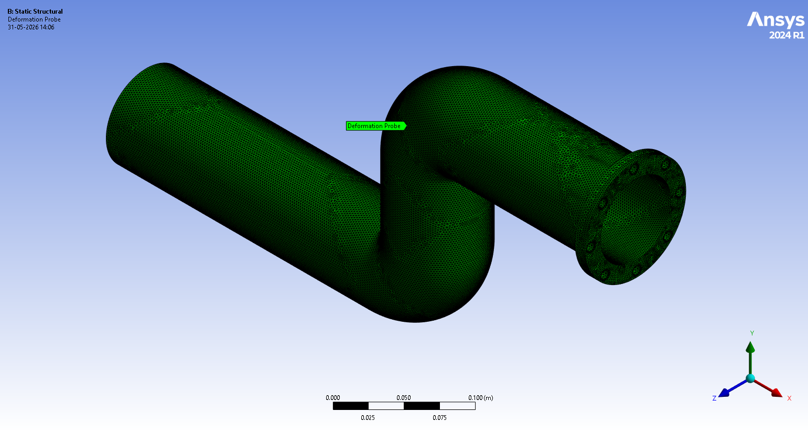

### Equivalent (von Mises) Stress

Maximum 10.48 MPa at the bend-to-straight transition and outer flange shoulder. Average across the pipe is 0.32 MPa.

| Time [s] | Max Total Def [µm] | Max von Mises [MPa] | Max Principal Stress [MPa] |
|---|---|---|---|
| 1 × 10⁻³ | 3.06 | 2.00 | 1.08 |
| 2 × 10⁻³ | 6.38 | 4.12 | 2.21 |
| 3 × 10⁻³ | 9.63 | 6.21 | 3.32 |
| 4 × 10⁻³ | 12.95 | 8.34 | 4.43 |
| 5 × 10⁻³ | 16.28 | 10.48 | 5.54 |

<!-- Add Equivalent Stress contour -->
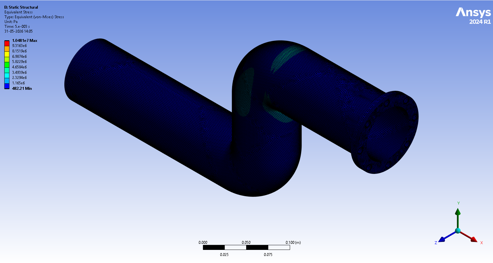

### Directional Deformation (X)

<!-- Add Directional Deformation contour -->
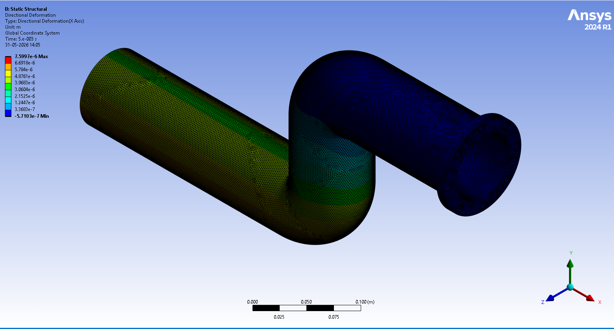

### Maximum Principal Stress

<!-- Add Max Principal Stress contour -->
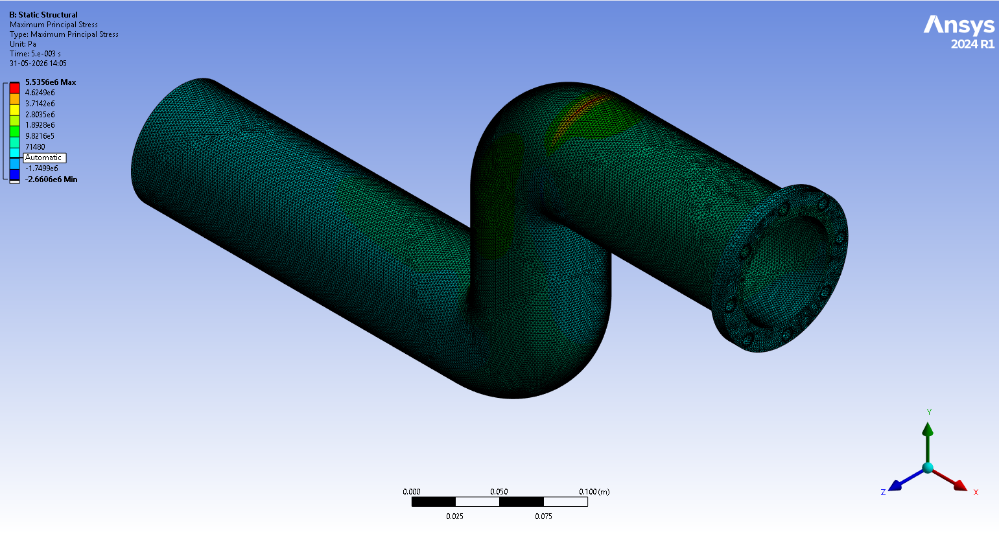

### Maximum Principal Elastic Strain

Peak 2.22 × 10⁻⁵ m/m, well inside the elastic regime (yields at ~1.25 × 10⁻³ strain).

<!-- Add Max Principal Strain contour -->
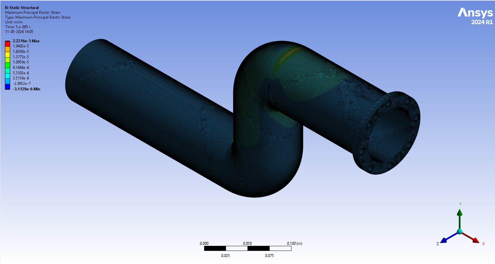

---

## Phase 3 — Modal Analysis

20 modes requested using the Direct (Block Lanczos) solver. Pre-stress link not used: at peak von Mises stress of only 10.5 MPa (~4% of yield), stress-stiffening effect on natural frequencies is below 2%.

### Natural Frequencies

| Mode | Frequency (Hz) | Type |
|---|---|---|
| 1 | 225.62 | Lateral bending (first principal direction) |
| 2 | 235.32 | Lateral bending (orthogonal direction, near-degenerate) |
| 3 | 666.39 | Second bending mode |
| 4 | 809.84 | Third bending mode |
| 5 | 1698.1 | Higher-order bending |
| 6 | 2317.0 | Cross-section ovaling (degenerate pair) |
| 7 | 2317.4 | Cross-section ovaling (orthogonal) |
| 8 | 2814.8 | Higher-order ovaling |
| 9 | 2873.7 | Higher-order ovaling |
| 10 | 2956.4 | Higher-order bending/ovaling |
| 11 | 3583.7 | Higher-order cross-section mode |
| 12 | 4036.6 | Higher-order cross-section mode |
| 13 | 4265.4 | Higher-order cross-section mode |
| 14 | 4551.4 | Higher-order cross-section mode |
| 15 | 4723.2 | Higher-order cross-section mode |
| 16 | 4794.1 | Higher-order cross-section mode |
| 17 | 4840.3 | Higher-order cross-section mode |

### Mode Shapes

Mode 1 at 225.62 Hz: first-order bending of the cantilevered inlet span. Free inlet end shows maximum amplitude; S-bend and outlet section show minimal motion.

<!-- Add Mode 1 contour at 225.62 Hz -->
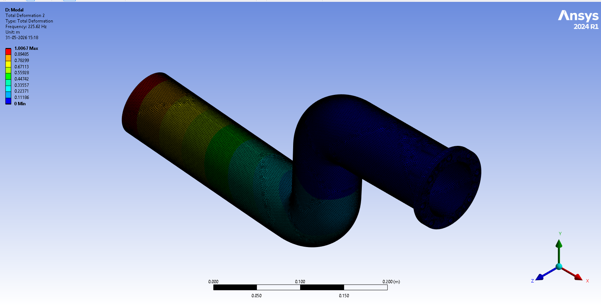

Mode 2 at 235.32 Hz: orthogonal companion of Mode 1, bending in the perpendicular plane. The 4% frequency split reflects the geometric asymmetry of the S-shape relative to the support axes.

<!-- Add Mode 2 contour at 235.32 Hz -->
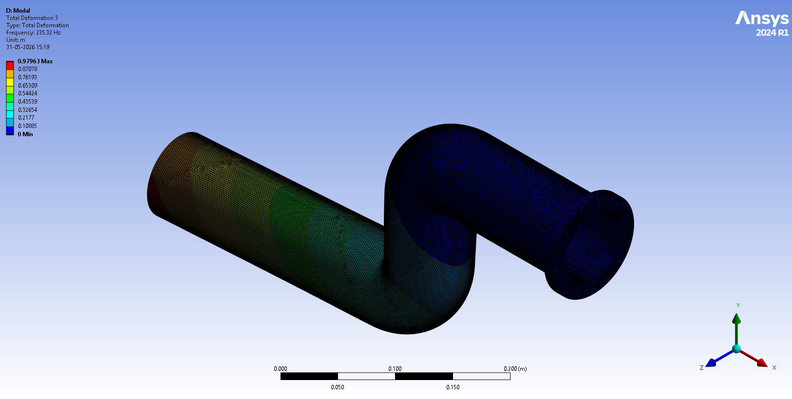

### Resonance Margin against Vortex Shedding

Strouhal frequency for the operating point: f_shed = 0.2 × 6 / 0.08 = 15 Hz.

| Excitation | Frequency (Hz) | Danger band (±15%) | Ratio to Mode 1 |
|---|---|---|---|
| Fundamental shedding | 15 | 12.75 – 17.25 | 15.0× |
| 1st harmonic | 30 | 25.5 – 34.5 | 7.5× |
| 2nd harmonic | 45 | 38.25 – 51.75 | 5.0× |
| 3rd harmonic | 60 | 51 – 69 | 3.8× |
| 10th harmonic | 150 | 127.5 – 172.5 | 1.5× |

No structural mode falls within ±15% of any vortex shedding harmonic up to the 14th (210 Hz). Resonance risk is negligible.

---

## Phase 4 — Harmonic Response

Mode Superposition on the 20 modes from Phase 3. Oscillating pressure of 700 Pa amplitude applied to the 10 inner-bore faces (~5% of the mean static pressure as a conservative fluctuating-component estimate). Sweep range: 0 to 300 Hz, with cluster results enabled near modes. Damping: constant ratio ζ = 0.02.

### Frequency Response

Peak amplitude 2.94 µm at 225.53 Hz (Mode 1). Static (DC) amplitude 0.146 µm. Phase crosses −90° exactly at the peak.

| Frequency (Hz) | Amplitude (µm) | Phase (°) |
|---|---|---|
| 0 | 0.1464 | 0 |
| 210.13 | 0.8845 | −15.16 |
| 224.40 | 2.860 | −74.22 |
| **225.53** | **2.939 (peak)** | **−88.22** |
| 225.62 | 2.938 | −89.36 |
| 226.84 | 2.812 | −104.5 |
| 230.47 | 1.946 | −136.1 |
| 235.32 | 1.178 | −153.9 |
| 252.66 | 0.4222 | −169.1 |
| 300.00 | 0.1164 | −174.4 |

### Probe Location

<!-- Add Deformation Probe location screenshot -->
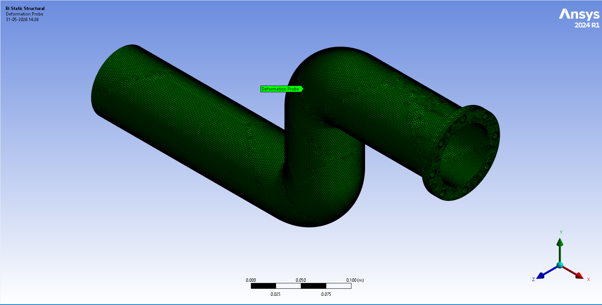

### Bode Plot

<!-- Add Frequency Response (Bode) plot -->
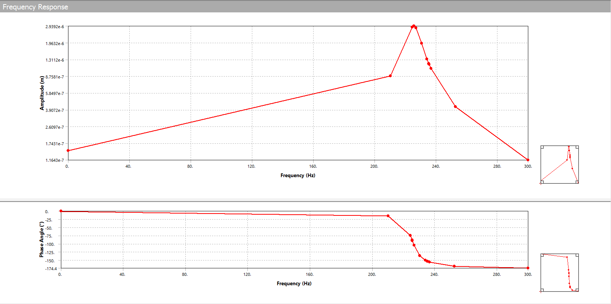

### Dynamic Amplification Factor

DAF = peak / static = 2.94 × 10⁻⁶ / 1.464 × 10⁻⁷ ≈ **20.1**

Theoretical DAF for ζ = 0.02 is 1/(2ζ) = 25. The 20% offset accounts for off-mode contributions from Mode 2 and finite frequency resolution.

Implied dynamic stress increment: Δσ_dyn ≈ (2.94 / 16.3) × 10.48 MPa ≈ 1.9 MPa.
Combined peak stress (static plus worst-case dynamic): ~12.4 MPa, still a factor of 20 below yield.

---

## Phase 5 — Fatigue Analysis

Stress Life approach with Zero-Based loading (R = 0) and Goodman mean-stress correction. ASME BPV Section 8 Div 2 S-N curve for Structural Steel, extended linearly to 10¹⁰ cycles at the 86.2 MPa endurance limit.

| Setting | Value |
|---|---|
| Analysis Type | Stress Life |
| Loading Type | Zero-Based |
| Scale Factor | 1.0 |
| Mean Stress Theory | Goodman |
| Stress Component | Equivalent (von Mises) |
| Strength Factor (Kf) | 1.0 |
| Design Life | 1 × 10⁹ cycles |

### Loading Definition

<!-- Add fatigue loading + mean-stress correction diagram -->

### Fatigue Results

| Result | Value | Interpretation |
|---|---|---|
| Min Life | 1 × 10¹⁰ cycles (S-N curve max) | Saturated; effectively infinite life |
| Equivalent Alternating Stress (max) | 5.30 MPa | 6.1% of endurance limit (86.2 MPa) |
| Damage at 10⁹ design cycles | 0.10 | 10% of fatigue capacity consumed |
| Min Safety Factor | 13.85 | ~4× critical-service threshold |
| Biaxiality (min / max) | −1.0 / +0.9998 | Mixed stress states; Goodman applies |

### Life Contour

<!-- Add Fatigue Life contour -->
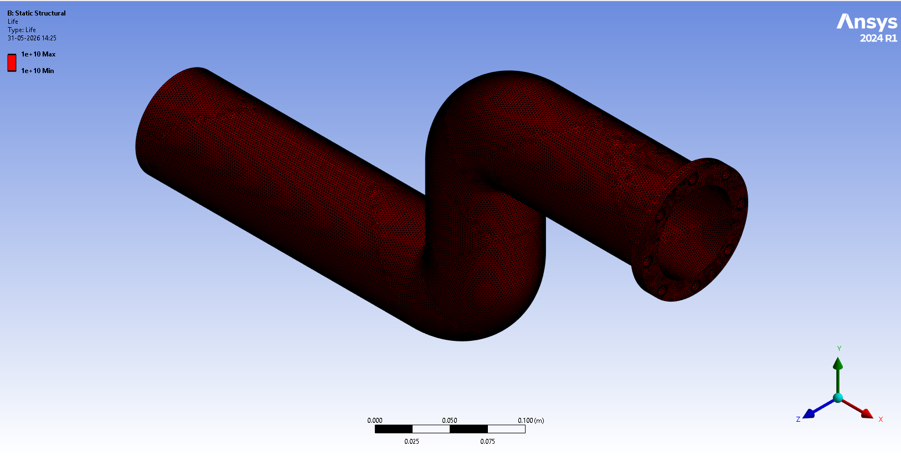

### Damage Contour

<!-- Add Damage contour -->
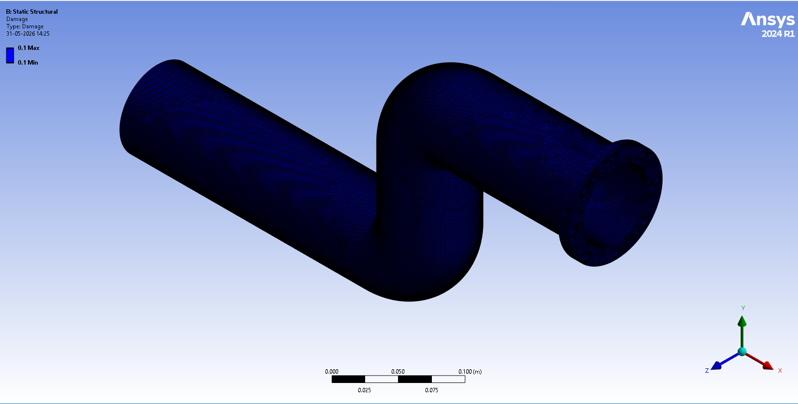

### Safety Factor Contour

<!-- Add Safety Factor contour -->

### Biaxiality Indication

<!-- Add Biaxiality contour -->
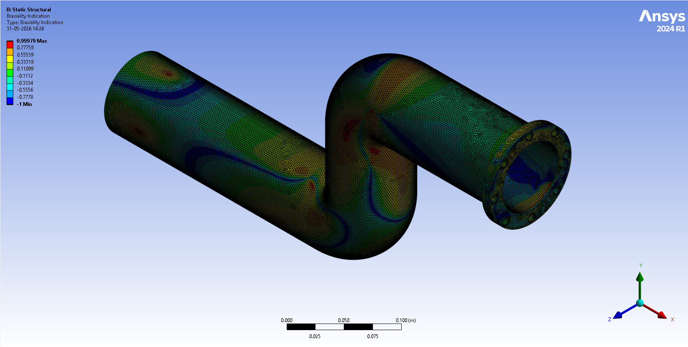

### Equivalent Alternating Stress

<!-- Add Eq. Alt. Stress contour -->
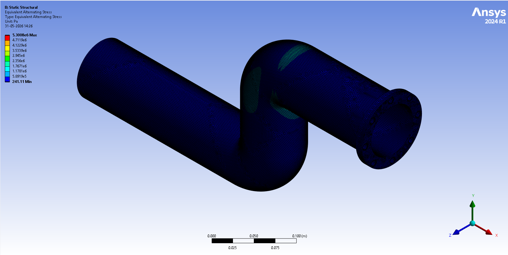

---

## Consolidated Results

| Phase | Quantity | Value | Status |
|---|---|---|---|
| 1. CFD | Pressure drop (ΔP) | 25.5 kPa | Consistent with K-factor estimate |
| 1. CFD | Maximum velocity | 13.0 m/s | Inner-bend acceleration |
| 1. CFD | Maximum wall shear | 3.32 kPa | Low erosion risk |
| 2. FSI | Maximum total deformation | 16.28 µm | Negligible elastic response |
| 2. FSI | Maximum von Mises stress | 10.48 MPa | 24× below yield (250 MPa) |
| 3. Modal | Fundamental frequency (f₁) | 225.62 Hz | 15× above shedding |
| 3. Modal | Second mode (f₂) | 235.32 Hz | Near-degenerate companion |
| 4. Harmonic | Peak amplitude at f₁ | 2.94 µm | DAF ≈ 20 |
| 5. Fatigue | Maximum alternating stress | 5.30 MPa | 6% of endurance limit |
| 5. Fatigue | Minimum Safety Factor | 13.85 | ~4× industry standard |
| 5. Fatigue | Damage at 10⁹ cycles | 0.10 | 10% of fatigue capacity |

### Failure-Mechanism Summary

| Failure Mode | Governing Quantity | Result | Margin |
|---|---|---|---|
| Static overstress | von Mises / Yield | 10.48 MPa / 250 MPa | 24× below yield |
| Static deformation | Total deformation | 16.28 µm | Geometrically negligible |
| Modal resonance | f₁ / f_shed | 225.62 Hz / 15 Hz | 15× above excitation |
| Dynamic amplification | Combined dynamic / Yield | ~12.4 MPa / 250 MPa | 20× below yield |
| High-cycle fatigue | Safety Factor at 10⁹ cycles | 13.85 | ~4× industry standard |

---

## Engineering Conclusions

- The pipe is structurally safe for the assessed operating conditions at 6 m/s fuel-oil flow.
- Static stresses are an order of magnitude below yield, with substantial margin against deformation.
- All natural frequencies sit well above any flow-induced excitation; resonance risk is negligible.
- Dynamic amplification under hypothetical resonance is moderate (DAF ≈ 20), and the resonant frequency is not accessible to the available flow excitation.
- Maximum alternating stress is below 7% of the endurance limit; fatigue is not a credible failure mechanism.
- Two-way FSI is dominated by Mechanical compute cost (75%), unusual for FSI in general but consistent with quadratic-tet structural meshes and small fluid domains.
- Under-relaxation factors of 0.7 (force) and 0.8 (displacement) produced a 6× speedup over default settings with no loss in accuracy.

---

## Caveats and Limitations

- FSI duration of 5 ms covers only ~12% of one flow-through time; deformation and stress were still growing linearly at run end. Extrapolation suggests asymptotic values of 50–150 µm deformation and 30–80 MPa stress, still a factor of 3–8 below yield.
- No formal mesh-independence study (no GCI). Mesh is in the engineering-validated tier but not regulatory-grade.
- Pre-stress was not coupled into the Modal analysis. Effect on natural frequencies estimated below 2% at the present stress level.
- The 700 Pa Harmonic Response load is a conservative estimate, not extracted from a transient FSI pressure spectrum.
- Material data are nominal Structural Steel from the ANSYS library, not the specific pipeline grade (X42 to X70 would have higher allowables).

---

## Project Files

| File | Description |
|---|---|
| `PIPE.wbpj` | ANSYS Workbench project |
| `FFF.cas.h5` | Fluent case file (poly-hexcore mesh + setup) |
| `*.xls` | Exported time-history data (deformation, stress, frequency response) |
| `FSI_S_Pipe_Report.docx` | Full project report (33 pages, all phases) |
| `images/` | Result contours and screenshots |
| `README.md` | This document |

### Exported Data

| File | Contents |
|---|---|
| `Total_deformation.xls` | Min/Max/Avg over 5 timesteps |
| `Equivalent_stress.xls` | Min/Max/Avg over 5 timesteps |
| `Directional_deformation.xls` | X-axis component over 5 timesteps |
| `Maximum_principal_stress.xls` | Tensile principal stress over 5 timesteps |
| `Maximum_pricipal_elastic_strain.xls` | Principal elastic strain over 5 timesteps |
| `Frequency.xls` | All 17 modal frequencies |
| `modal_total_deformation.xls` | Per-mode deformation indices |
| `Harmonic_Frequency_response.xls` | Amplitude and phase vs frequency |
| `harmonic_total_deformation.xls` | Per-frequency total deformation results |

---

## Future Work

- Extend the FSI run to one full flow-through time (~50 ms / 50 timesteps) to capture asymptotic stress
- Three-level mesh-independence study (1.2 M / 2.5 M / 5 M fluid cells) with formal Grid Convergence Index per ASME V&V 20
- Replace the 700 Pa harmonic load with a true wall-pressure FFT spectrum from the extended FSI run
- Re-evaluate Modal with the Pre-Stress link enabled once peak stress exceeds ~50 MPa
- Substitute API 5L grade-specific material data (e.g. X52: yield 358 MPa, ultimate 455 MPa)
- Extend Fatigue Tool to variable-amplitude rainflow analysis from the extended FSI pressure history
- Compare current results against shell-element FE model for computational-cost benchmarking

---

## Author

**Mohammad Haris** — Mechanical Engineer | FEA & CFD Engineer

GitHub: [github.com/MohammadHaris13](https://github.com/MohammadHaris13)

---

*This project is intended for academic and research purposes.*
